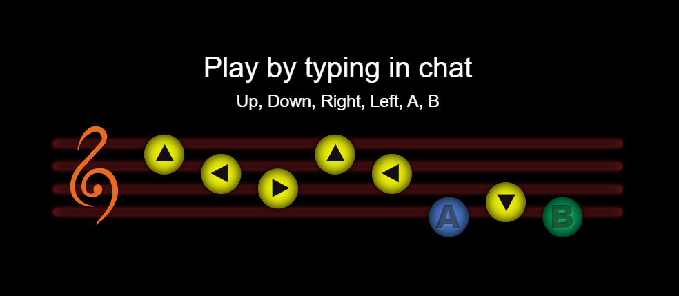
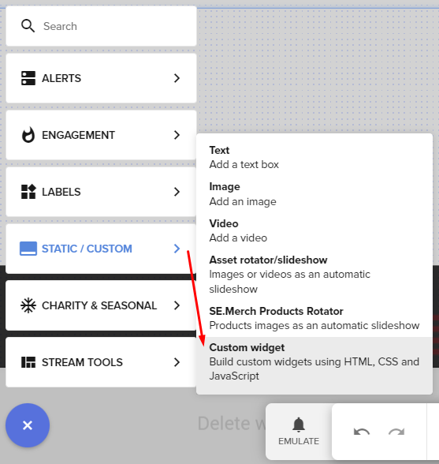
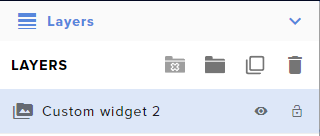
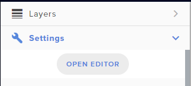
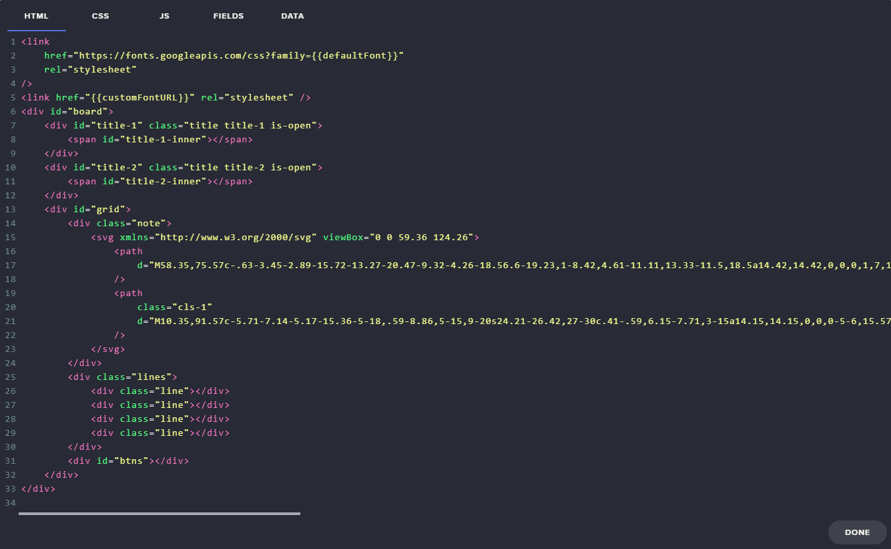
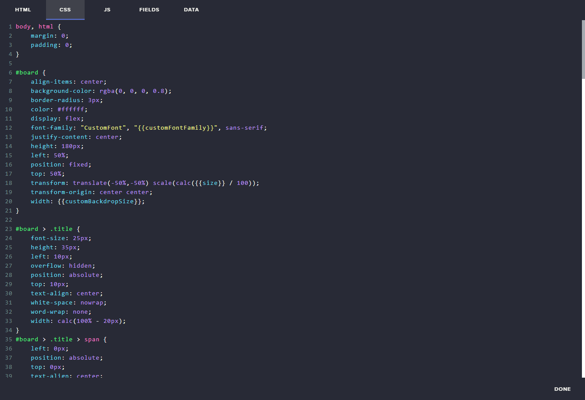
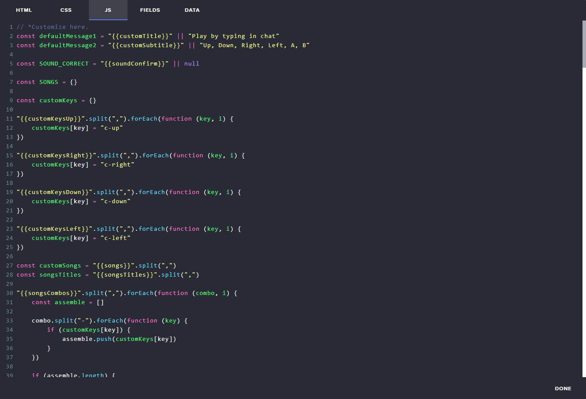
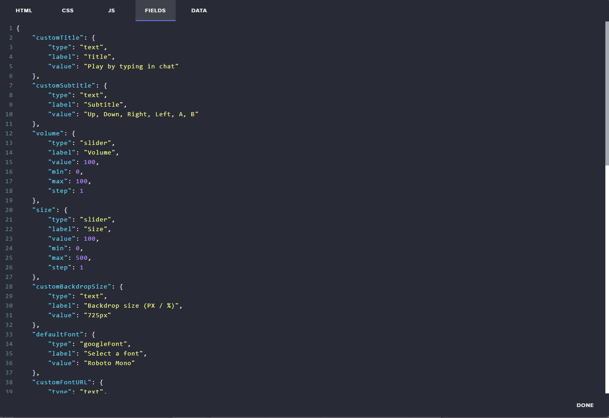

 

# Summary

-   [StreamElements - Before Starting](https://dev.streamelements.com/docs/widgets/3cf52461e4e34-before-starting)
-   [StreamElements - Custom Widgets](https://dev.streamelements.com/docs/api-docs/775038fd4f4a9-stream-elements-custom-widgets)
-   [How to](#how-to)
-   [FAQ](#faq)
-   [Support](#consider-supporting-me)

 

# How to

([Back to top](#summary))

1. Create a new StreamElements Custom Widget:  
   

 

2. Under "Layers", select your newly created "Custom Widget":  
   

 

3. Click "Settings", then "Open Editor":  
   

 

4. Paste the contents of the `index.html` file into the `HTML` tab:  
   

 

5. Paste the contents of the `styles.css` file into the `CSS` tab:  
   

 

6. Paste the contents of the `scripts.js` file into the `JS` tab:  
   

 

7. Paste the contents of the `fields.json` file into the `FIELDS` tab:  
   

 

8. Click "Done".

 

Your overlay should be ready to use.  
Use the "Settings" tab (step 3, above) to customize your widget.

 

# FAQ

([Back to top](#summary))

### Whenever I hit a combo, the keys flash and nothing else happens.

A: Select a [Song found effect].

### Can I add any song I want?

A: Yes. As long as you mind the order of files, combos and titles.

### Where do I find the full list of Ocarina songs to use?

A: The internet. But I also left a [convenient file](copy-these-titles.txt) and a [convenient folder](songs/), in this repo.

### Where do I find the full list of Ocarina combos to use?

A: The internet. But I also left a [convenient file](copy-these-combos.txt), in this repo.

 
 

# Consider supporting me

([Back to top](#summary))

-   [Buy me a coffee](https://www.buymeacoffee.com/gataquadrada)
-   [Follow me on Twitter](https://twitter.com/gataquadrada)
-   [Follow me on Twitch](https://twitch.tv/gataquadrada)
-   [Join my Discord](https://discord.gg/eYfSNQT)
-   [Get sub emotes on my channel](https://twitch.tv/gataquadrada)
